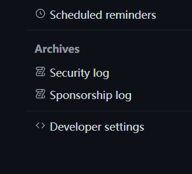

<div align=center>

# GitHub倉庫與連結 #

</div>

> GitHub的首頁

```
https://github.com/
```

## 來到首頁之後選擇`Sign UP`創建帳號


<br>

## 帳號辦理完成來到該介面選擇`New repository`創建存儲庫


<br>

## 接著設置

+ **設定存儲庫名稱**


+ 設定公開項目還是私有


+ **最後創建即可**


<br>

## 如果已經設置好連結資料夾, 上傳資料夾然後輸入
```
git remote add origin https://github.com/GitHub_ID/存儲庫名稱.git
```
### 之後可以直接再GitHub上進行修改,然後commit就好了

+ **查看分支**
```
git branch -a
```
+ **本地端要同步新修改就直接輸入**
```
git pull
```
```
git push origin
```

+ **本地端提交更新**
```
git commit -a -m "更新註解"
```

<br><hr><br>

## 與Vs code的cmd連結設置

+ **這邊是創好一個存儲庫還沒連結Vs code的部份**
+ `首先要到一個要上傳的資料夾下,直接在上方輸入 cmd`
+ `或是開啟CMD後,再使用CD指令開啟路徑位置`


<br>

+ **接著初始化**

```
git init
```

+ **創建一個 README.md**

```
echo test> README.md
```
+ **接著輸入**

```
git add README.md
```

+ **第一次,需要先設置Config**

+ `只想設置該路徑就把 --global 去掉`

```
git config --global user.name "Your Name"
```
```
git config --global user.email "your @mail.com"
```

+ **開始創建項目**

```
git commit -m "你要創建的專案名稱"
```

+ **創建分支**

```
git branch -M "你的分支名稱"
```

+ **然後輸入你的倉庫位置**

```
git remote add origin https://github.com/itsems/<你的repo>.git
```
+ **添加所有項目**

```
git add .
```

+ **就可以上傳了(不行的繼續)**

```
git push -u origin [你的分支名稱]
```

+ **不行的接著輸入**

```
git config --global credential.helper "store --file=~/.git-credentials"
```

+ **再輸入**

```
ssh-keygen -t rsa -b 4096 -C "Your Name"
```
**接著會出現`Enter file in which to save the key`(在後面輸入你的Key就好了)**

+ **再來會出現**

```
Enter passphrase (empty for no passphrase):
```
**你可以繼續輸入,或是選擇<kbd>Ctrl</kbd>+<kbd>C</kbd>直接跳過**

<br>

+ **之後到Vscode 就可以看到要上傳的資料 都變成綠色的**

**要提交的按+**


**是**


**打註解(不打不給傳)**


**同步上傳**


<hr>

## **沒有Key的取得方式**

+ **首先要到 頭像下的 `setting`**


+ **找到左側列表中最下方的 `Developer settings`**



+ **點選 `Personal access tokens`**


+ **然後創建一個私鑰or公鑰 (主要設置授權的時間 , 其他隨意)**


## 用記事本另外紀錄Key,之後是看不到的

<br><hr><br>

## SSH 密鑰連結

+ **首先在下載下來的文件路徑開啟cmd,然後輸入**
```
ssh-keygen -t ed25519 -C "your mail"

(上面的不支援就用下面的)

ssh-keygen -t rsa -b 4096 -C "your mail"

(額外硬件驗證 [保存到 USB 之類的])

ssh-keygen -t ed25519-sk -C "your mail"
ssh-keygen -t ecdsa-sk -C "your mail"
```

+ **接著一直按 Enter 直到看到 (不一定完全一樣)**
<pre>
The key fingerprint is:
SHA256:************************** your@gmail.com or name
The key's randomart image is:
+---[RSA 4096]----+
|                 |
|                 |
|      o          |
|     . = . .     |
|      . S.=      |
|       =+O o   .o|
|   + ..+=oO o. oo|
|  o +.oEo=oBo.. .|
| ..+o  +=++.oo...|
+----[SHA256]-----+
</pre>

+ **號這邊正常就是你的密鑰,當然不會是這符號**
<pre>
之後到使用者路徑
例如 (根據創建的類型):

%userprofile%/.ssh/*.pub

C:/Users/user/.ssh/id_ed25519.pub
C:/Users/user/.ssh/id_rsa.pub

找到 *.pub
使用CMD 執行以下命令 將密鑰複製出來

clip < id_ed25519.pub
clip < id_rsa.pub
</pre>

+ **接著到要設置的存儲庫,選擇設定**


+ **找到左側欄的Deploy keys**


+ **最後將剛剛複製的Key貼上,並且輸入個標題,之後添加即可**


+ **測試 SSH 是否連接到 GitHub**
```
ssh -T git@github.com

首次連接還需要輸入 yes 驗證
```
<hr>