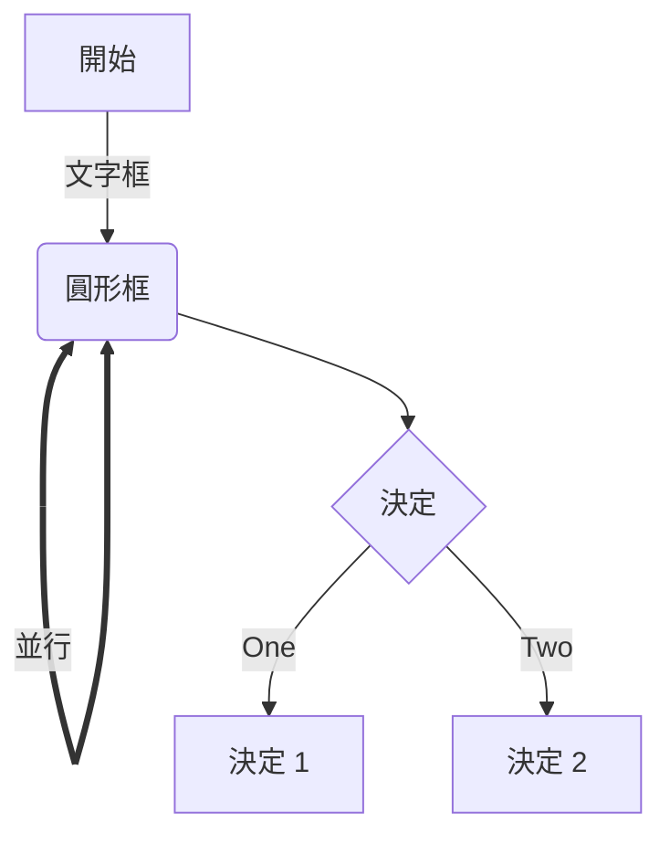

<div align=center>

# Markdown的使用筆記

---
</div>

> 說明 : **Markdown 是一種輕量級標記語言，它允許人們使用易讀易寫的純文本格式編寫文檔。**

> 應用 : **許多網站都廣泛使用 Markdown 來撰寫幫助文檔或是用於論壇上發表消息。**

---
## 圖案

| 鉛筆 | 電腦 | 雲朵 | 調色盤 | 存檔 | 咖啡 | 燈泡 | 工具 | 西瓜 | 筆記 | 警告 |
| :---: | :----: | :---: | :----: | :----: | :----: | :----: | :----: | :----: | :----: | :----: |
|:pencil2:|:computer:|:cloud:|:art:|:floppy_disk:|:coffee:|:bulb:|:wrench:|:watermelon:|:memo:|:warning:|

<hr>

## 使用教學

> 標題

一級標題
(在文字下方輸入=====)
====== 

二級標題
(在文字下方輸入-----)
-------

# 一級標題
(前方輸入 #)
## 二級標題
(前方輸入 ##)
### 三級標題
(前方輸入 ###)
#### 四級標題
(前方輸入 ####)
##### 五級標題
(前方輸入 #####)
###### 六級標題
(前方輸入 ######)

<hr>

> 文本效果

*斜體文本* (在* *內輸入文字)
_斜體文本_ (在_ _內輸入文字)

**粗體文本** (在** **內輸入文字)
__粗體文本__ (在__ __內輸入文字)

***粗斜體文本*** (在*** ***內輸入文字)
___粗斜體文本___ (在___ ___內輸入文字)

~~刪除線~~
<u>下劃線文本</u>
`[^RUNOOB]: 文本註解`

<hr>

> 文本換行

<p>可以直接使用</p>
HTML 中的 p 標籤進行換行<br>或是br

<hr>

> 分隔線

`***`

`* * *`

`*****`

`- - -`

`----------`

<hr>

> 無序與有序列表

* 使用一個*
+ 使用一個+
- 使用一個-

1. 第一項 (有序使用數字 + . )
    * 第一項嵌套的第一個元素(*)
    * 第一項嵌套的第二個元素(*)
2. 第二項
    + 第一項嵌套的第一個元素(+)
    + 第一項嵌套的第二個元素(+)
3. 第三項
    - 第一項嵌套的第一個元素(-)
    - 第一項嵌套的第二個元素(-)

<hr>

> 引用區塊

> 第一層引用 (在最前面打>)
>> 第二層引用 (在最前面打>>)
>>> 第三層引用 (在最前面打>>>)

<hr>

> 代碼的標記

(在最上方與最下方打上 ```)
```javascript
$(document).ready(function () {
    alert('test');
});
```

<hr>

> URL連結

文字連結 : `[連結文字] (連結)`
[我的GitHub](https://github.com/HentaiSaru)

圖片連結 : `[連結文字] (連結)`


直接連結 : `<連結>`
<https://github.com/HentaiSaru>

<hr>

> 放入圖片

圖標 : ``


如果要設置大小就要使用 : ``


<hr>

> 表格使用

|  表頭   | 表頭  |
|  ----  | ----  |
| 單元格  | 單元格 |
| 單元格  | 單元格 |

-: 設置內容和標題欄居右對齊。
:- 設置內容和標題欄居左對齊。
:-: 設置內容和標題欄居中對齊。

| 左對齊 | 右對齊 | 居中對齊 |
| :-----| ----: | :----: |
| 單元格 | 單元格 | 單元格 |
| 單元格 | 單元格 | 單元格 |

<hr>

> 特別技巧

使用 <kbd>Ctrl</kbd>+<kbd>Alt</kbd>+<kbd>Del</kbd> 用kbd標籤將要轉換的包起來

使用反斜線將特殊字元顯示

<pre>
\\   反斜線
\`   反引號
\*   星號
\_   下劃線
\{}  花括號
\[]  方括號
\()  小括號
\#   井字號
\+   加號
\-   減號
\.   英文句點
\!   感嘆號
</pre>

<hr>

> 複選選項框

- [x] A
- [ ] B
- [x] C
- [ ] D
- [x] E

<hr>

> Mermaid 繪製流程圖

~~**這東西有點複雜以後在學**~~

